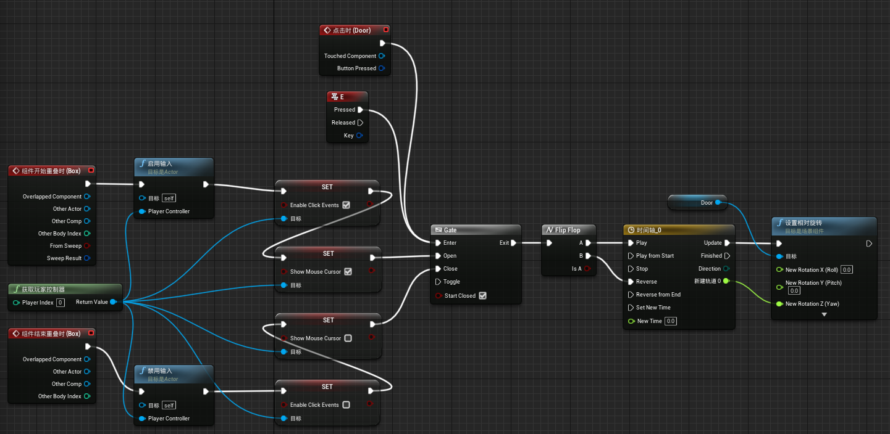
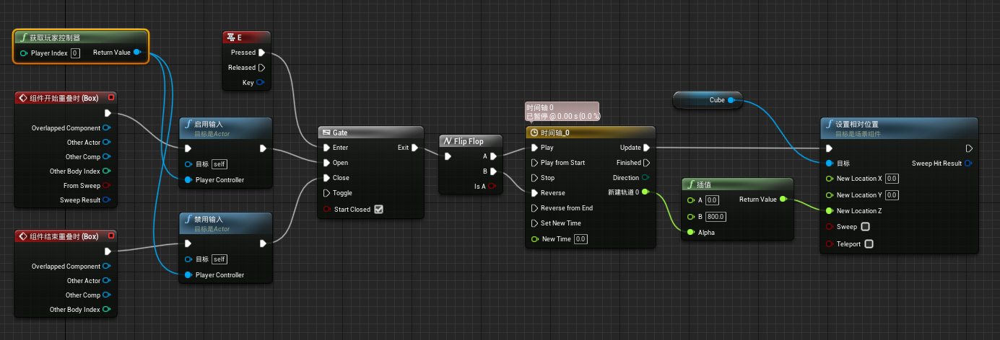

# UE4笔记

## 学习路径

官方文档：

[虚幻引擎4文档](https://docs.unrealengine.com/zh-CN/index.html)

官方论坛：

[Forum](https://forums.unrealengine.com/)

Reddit论坛：

[reddit](https://www.reddit.com/)

## 免费素材

- 虚幻商城中免费栏
- 虚幻商城中学习栏下Engine Feature Samples
- Youtube上搜索unreal free download、ue4 free project download等
- B站UP主 墨鱼驴肉汤
- 虚幻官方论坛 社区内容，工具和教程下置顶自由社区资产

## 安装问题

安装完4.25版本引擎后打开，出现了如下报错：

```cpp
Assertion failed: GConfig->GetBool( LDev Options.Shaders, LbAllowCompilingThroughWorkers, bAllowCompilingThroughWorkers, GEngineIni ) [File:D:/Build/++UE4/Sync/Engine/Source/Runtime/Engine/Private/ShaderCompiler/ShaderCompiler.cpp]
```

官方并没有给予这一问题的解决办法，并且根据crashlog可以看出问题出在引擎自己的c库中，解决办法如下图，单击出现问题版本的引擎下拉菜单，选择“验证”，会进入文件完整性的验证，带验证完成后，问题得到解决。


参考文档：[https://blog.csdn.net/qq_37792061/article/details/106051045](https://blog.csdn.net/qq_37792061/article/details/106051045)

## 项目工程

### 新建项目

- 引擎版本向下兼容，高版本可以打开低版本工程，低版本不能打开高版本工程。

### 修改工程缓存路径

- 引擎文件目录下BaseEngine.ini文件，如下图，修改路径中InstalledDerivedDataBackendGraph条目下`ENGINEVERSIONAGNOSTICUSERDIR%DerivedDataCache`为`GAMEDIR%DerivedDataCache`


### 工程文件夹结构

- Config：包含了项目设置，键盘输入之类的配置文件
- Content：存放引擎或游戏的内容，包括地图、贴图、模型、材质、蓝图等
- Intermediate：包含在编译引擎或游戏时生成的临时文件
- Saved：包含自动保存的内容，配置（*.ini）文件以及日志文件
- .uproject：项目启动程序
- DerivedDataCache：如果修改了缓存路径

### 编辑器

- 个人选择vscode，因为使用更多更顺手且轻量，需要加载插件并修改相关设置，参考：[https://www.cnblogs.com/AnKen/p/10654678.html](https://www.cnblogs.com/AnKen/p/10654678.html)

### 资源导入

- 命名规范：[https://github.com/Allar/ue4-style-guide](https://github.com/Allar/ue4-style-guide)

## 物体编辑

- [笛卡尔坐标系](https://baike.baidu.com/item/%E7%AC%9B%E5%8D%A1%E5%B0%94%E5%9D%90%E6%A0%87%E7%B3%BB/4522878?fr=aladdin)

### BSP

- 尽管现在主要使用StaticMeshes(静态网格物体)来组成关卡，但是BSP画刷仍然有它的用途
  - 粗略画出关卡
  - 简单过滤几何体
- 添加、挖空两种模式
- 固体性
- 材质添加
- BSP画刷工具编辑

### 地形工具

- 编辑样条曲线：道路、河流
- 灰度图导入：
    1. 下载灰度图
    2. 使用ps打开图片，调整图像模式为灰度并调整颜色通道为16位，保存为png或raw
    3. 在地形工具管理下从文件导入

### 植被工具

- Align to Normal对齐到法线
- Cull Distance可视距离
- 设置碰撞→简单碰撞或凸包分解

## 蓝图

- 蓝图类：方便多次使用和替换素材
- 简单触发门：
    1. 给门添加碰撞
    2. 添加盒体触发器
    3. 在蓝图中给盒体触发器添加进入离开事件，增加门的引用，给门添加旋转方法
    4. 增加时间轴，设置曲线，切记修改时间轴长度



- 简单电梯：注意电梯地面与碰撞检测盒的层级关系



- 蓝图通信：
    1. 自定义事件
    2. 类型转换（类似C++的类型转换）
    3. 控制台命令

- 常用的api可以通过不断使用进行熟悉及掌握

## 常用快捷键

主要还是多用，熟能生巧

1. 自定义快捷键
2. W、E、R对应位移、旋转、缩放
3. Alt+2到0除了9视图模式切换
4. Alt+C显隐场景中的碰撞
5. Ctrl+Alt+鼠标左键框选
6. T是否能选中半透明物体
7. H隐藏物体
8. Ctrl+E编辑物体
9. Ctrl+B查找路径
10. Alt+P开始游戏

# ACT项目

## 动画

- 动画蓝图/混合空间：动画蓝图用于创建和控制复杂动画行为，而混合空间是允许根据多个输入的值混合任意数量动画的资源。
- 动画重定向（重定位）：是一种允许在共用相同骨架 资源但比例差异很大的角色之间复用动画的功能。通过重定位，可以防止生成动画的骨架在使用来自不同外形的角色的动画时丢失比例或产生不必要的变形。 通过动画重定位，还可以在使用**不同骨架**资源的角色之间共享动画，前提是他们使用相似的骨骼层级，并使用名为**绑定**（Rig）的共享资源在骨架之间传递动画数据。


通过速度来控制动画的切换，待机、走路、跑步

- 动画蒙太奇：控制动画资源的途径，可以添加关键帧事件，设置播放方式等。通过动画抛出事件，方便程序实现对应业务逻辑，或是产生粒子或是播放音效等。


- 动画融合：在人物受到攻击的时候，如果单纯播放被攻击的动画，人物在移动中的腿部动画会被覆盖，会很奇怪，像在地上漂移；使用动画融合，将需要的动画pose储存起来，而后进行融合，在融合时选择需要混合骨骼的名字，如上半身的骨骼，就可以实现在被攻击时上身播放受击动画，下半身仍维持移动的动画；还需要注意的是，当人物不处于移动中时，播放完整的受击动画即可。


## 人物

- 人物控制蓝图：


根据第三人称模版，自己熟悉并书写了一遍

- 人物视角：默认Pawn类中设置为跟随人物移动的视角，既肩旁朝向，通过修改为使用Controller视角，可以改变人物视角为屏幕视角，也可封装为简单函数进行使用。


根据是否在攻击，来改变视角的旋转方式

### 玩家

- 切换/显隐武器：改变两个武器mesh对象在手的显隐。
- 连招：通过建立数据库，存储多个攻击动画，通过控制一次播放动画达成连招效果。


- 特殊攻击：攻击中按下右键，本次攻击完后取消连招，播放指定的特殊攻击动画。


- 重置连招：在动画播放完后，如果没有控制攻击，则重置连招。


- 打击特效：击中敌人后，对渲染速度进行调整，实现慢镜头效果，同时晃动屏幕（摄像机），用到了`SetGlobalTimeDilation`和`PlayCameraShake`两个方法，其中屏幕晃动需要建立晃动的类，不过虚幻已经为我们实现了基类，我们只需要调整参数即可。


- 武器碰撞：在武器上捆绑碰撞检测胶囊体，在攻击时开启碰撞，结束后关闭碰撞，同时要保证只有一次碰撞，在触发检测时要使用DoOnce进行伤害的输出，在一次攻击结束后，再reset掉DoOnce。

    

    两个物体不同碰撞设置对应的实现效果

- 受到伤害：如果未死亡播放受伤动画并终止当前连击，如果死亡则播放死亡动画。（虚幻引擎封装好了受到伤害及给予伤害的方法）

### 敌人

- 受击位移：敌人在受击后除去播放动画外，还需要进行位移，需要判断攻击者也就是玩家所处的位置以及打击的方向，向对应的角度及方向进行位移。


计算夹角


受伤位移，对应的数据会在受到攻击时设置

- 远程攻击：在攻击动画播放时从在手部生成一个对象，并发射向攻击目标，一段时间后销毁自身。（虚幻引擎封装好了发射方法）

## UI

- UI可以用作全屏，也可以用作绑定在Actor上，若是全屏的话需要在init时添加到视窗，若是在Actor上直接添加到Actor中即可。


## AI

- 三件套：AIController、行为树、黑板，AIController为控制器，可为Pawn添加。行为树控制AI的逻辑，既有限状态机，黑板则用来储存数据，方便行为树的执行和判断。


- 行为树中的节点：


- 简单AI：如果受击则无作为，未看到玩家进行随机巡逻，看到玩家会追逐玩家，根据冷却时间和距离进行近战及远程攻击。（自动寻路范围需要提前在场景内进行烘焙）


## 图形渲染

- 后期处理：在渲染前应用于整个渲染场景的效果。
