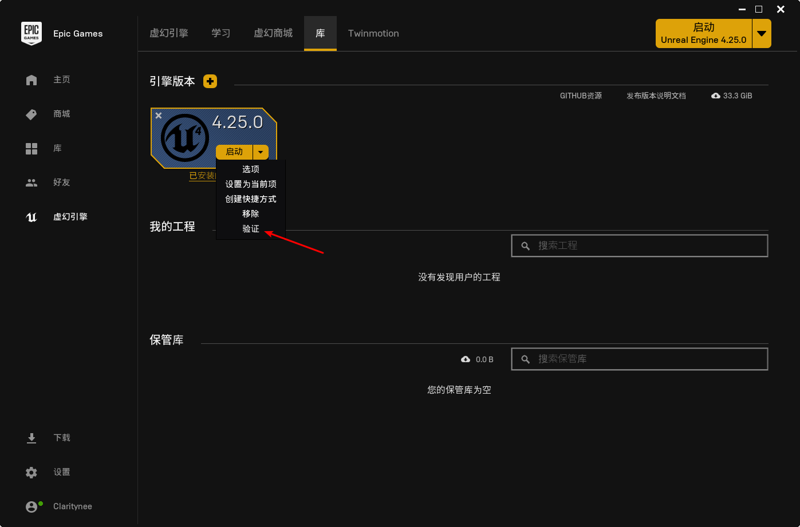
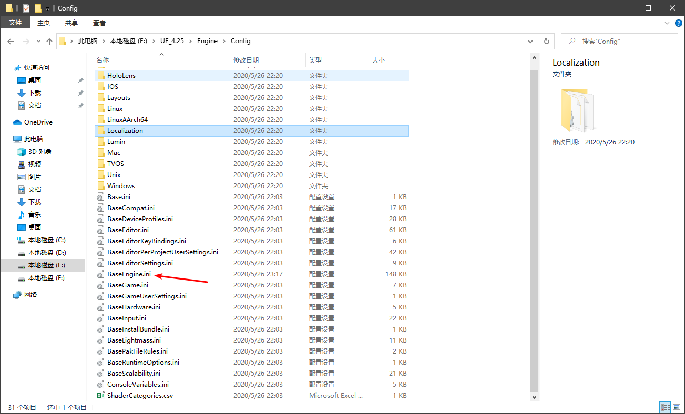

# UE4笔记

## 学习路径

官方文档：

[虚幻引擎4文档](https://docs.unrealengine.com/zh-CN/index.html)

官方论坛：

[Forum](https://forums.unrealengine.com/)

Reddit论坛：

[reddit](https://www.reddit.com/)

## 免费素材

- 虚幻商城中免费栏
- 虚幻商城中学习栏下Engine Feature Samples
- Youtube上搜索unreal free download、ue4 free project download等
- B站UP主 墨鱼驴肉汤
- 虚幻官方论坛 社区内容，工具和教程下置顶自由社区资产

## 安装问题

安装完4.25版本引擎后打开，出现了如下报错：

```cpp
Assertion failed: GConfig->GetBool( LDev Options.Shaders, LbAllowCompilingThroughWorkers, bAllowCompilingThroughWorkers, GEngineIni ) [File:D:/Build/++UE4/Sync/Engine/Source/Runtime/Engine/Private/ShaderCompiler/ShaderCompiler.cpp]
```

官方并没有给予这一问题的解决办法，并且根据crashlog可以看出问题出在引擎自己的c库中，解决办法如下图，单击出现问题版本的引擎下拉菜单，选择“验证”，会进入文件完整性的验证，带验证完成后，问题得到解决。



参考文档：[https://blog.csdn.net/qq_37792061/article/details/106051045](https://blog.csdn.net/qq_37792061/article/details/106051045)

## 项目工程

### 新建项目

- 引擎版本向下兼容，高版本可以打开低版本工程，低版本不能打开高版本工程。

### 修改工程缓存路径

- 引擎文件目录下BaseEngine.ini文件，如下图，修改路径中InstalledDerivedDataBackendGraph条目下`ENGINEVERSIONAGNOSTICUSERDIR%DerivedDataCache`为`GAMEDIR%DerivedDataCache`



### 工程文件夹结构

- Config：包含了项目设置，键盘输入之类的配置文件
- Content：存放引擎或游戏的内容，包括地图、贴图、模型、材质、蓝图等
- Intermediate：包含在编译引擎或游戏时生成的临时文件
- Saved：包含自动保存的内容，配置（*.ini）文件以及日志文件
- .uproject：项目启动程序
- DerivedDataCache：如果修改了缓存路径

### 编辑器

- 个人选择vscode，因为使用更多更顺手且轻量，需要加载插件并修改相关设置，参考：[https://www.cnblogs.com/AnKen/p/10654678.html](https://www.cnblogs.com/AnKen/p/10654678.html)

### 资源导入

- 命名规范：[https://github.com/Allar/ue4-style-guide](https://github.com/Allar/ue4-style-guide)

## 物体编辑

- [笛卡尔坐标系](https://baike.baidu.com/item/%E7%AC%9B%E5%8D%A1%E5%B0%94%E5%9D%90%E6%A0%87%E7%B3%BB/4522878?fr=aladdin)

### BSP

- 尽管现在主要使用StaticMeshes(静态网格物体)来组成关卡，但是BSP画刷仍然有它的用途
  - 粗略画出关卡
  - 简单过滤几何体
- 添加、挖空两种模式
- 固体性
- 材质添加
- BSP画刷工具编辑